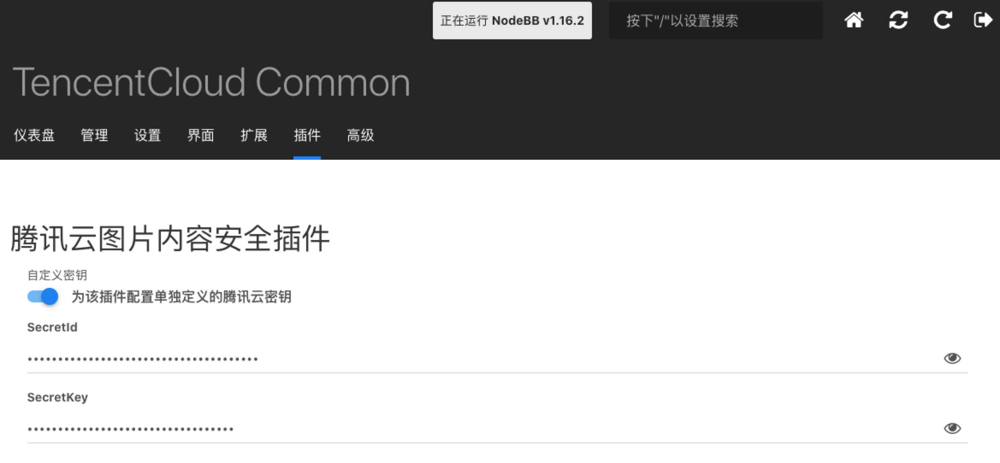
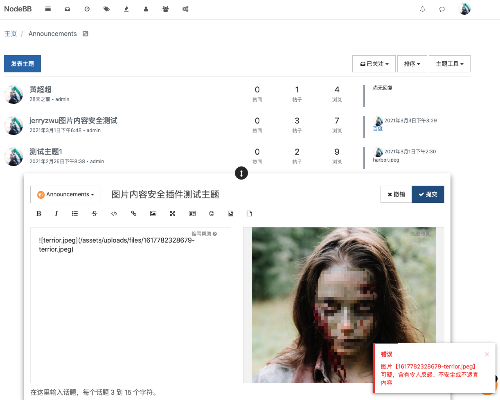

# 腾讯云图片内容安全（IMS）插件

## 0.版本依赖

- NodeBB 1.16.2+
- [腾讯云插件中心插件](./common.md)

## 1. 插件介绍
| 标题      | 名称    |
| ----     | ---------------- |
| 中文名称   | 腾讯云图片内容安全（IMS）插件 |
| 英文名称   | nodebb-plugin-tencentcloud-ims |
| 最新版本   | v1.0.0 (2021.03.16) |
| 适用平台   | [NodeBB](https://nodebb.org) |
| 适用产品   | [腾讯云图片内容安全（IMS）](https://cloud.tencent.com/product/ims) |
| GitHub项目| [tencentcloud-nodebb-plugin-ims](https://github.com/Tencent-Cloud-Plugins/tencentcloud-nodebb-plugin-ims) |
| gitee项目| [tencentcloud-nodebb-plugin-ims](https://gitee.com/Tencent-Cloud-Plugins/tencentcloud-nodebb-plugin-ims) |
| 主创团队   | 腾讯云中小企业产品中心（SMB Product Center of Tencent Cloud） |

一款腾讯云研发的，提供给NodeBB站长使用的官方插件，对用户在发帖或回复时图片中出现的违规涉黄、爆、恐等内容，进行内容检测和过滤

## 2. 功能特性
- 对用户在发帖或回复时图片中出现的违规涉黄、爆、恐等内容，进行内容检测和过滤

## 3. 安装指引

本插件需要调用插件中心插件，所以请先安装并启用插件中心插件：

### 3.1.部署方式一：通过NodeBB站点后台安装
> 1. 你的NodeBB站点后台=》插件=》已安装 =》寻找插件。在页面搜索框输入nodebb-plugin-tencentcloud-ims
> 2. 点击"安装"按钮，就会自动下载安装插件
> 3. 启用该插件

### 3.2.部署方式二：通过npm安装
> 1. 在你的NodeBB项目根目录执行npm install nodebb-plugin-tencentcloud-ims
> 2. 重启Nodebb应用
> 3. 启用插件

## 4. 使用指引
### 4.1.界面功能介绍

> 上图为后台配置页面。配置介绍请参考下方的[名词解释](#_4-2-名词解释)

> 上图为发帖页面，对发贴或回复时内容中的图片进行检测，检测不通过将会提示如上信息

### 4.2.名词解释
- **自定义密钥：** 插件提供统一密钥管理，既可在多个腾讯云插件之间共享SecretId和SecretKey，也可为插件配置单独定义的腾讯云密钥。
- **Secret ID：** 在[腾讯云API密钥管理](https://console.cloud.tencent.com/cam/capi)上申请的标识身份的 SecretId。
- **Secret Key：** 在[腾讯云API密钥管理](https://console.cloud.tencent.com/cam/capi)上申请的与SecretId对应的SecretKey。

## 5. 获取入口

| 插件入口      | 链接    |
| ----     | ---------------- |
| Github | [腾讯云图片内容安全（IMS）插件](https://github.com/Tencent-Cloud-Plugins/tencentcloud-nodebb-plugin-ims) |
| Gitee | [腾讯云图片内容安全（IMS）插件](https://gitee.com/Tencent-Cloud-Plugins/tencentcloud-nodebb-plugin-ims) |

## 6. FAQ
> 1. Q:腾讯云图片内容安全（IMS）插件依赖别的插件吗？
>    
>    A:腾讯云图片内容安全（IMS）插件插件依赖于腾讯云插件中心插件，所以请先安装并激活该插件,并配置好相应的插件配置

## 7. GitHub版本迭代记录

### 7.1. nodebb-plugin-tencentcloud-ims v1.0.1

- 对用户在发帖或回复时图片中出现的违规涉黄、爆、恐等内容，进行内容检测和过滤

## 8. 联系我们

如果您是用户，欢迎加入我们的[官方交流社区](https://dnspod.chat/category/10)，反馈
- bug和故障，获取帮助。
- 新的插件功能需求。
- 新的开源应用插件适配需求。

如果您是开发者，欢迎参与我们[插件开源项目](https://github.com/Tencent-Cloud-Plugins)，和我们一起修复插件问题，为更多开源应用适配腾讯云插件。